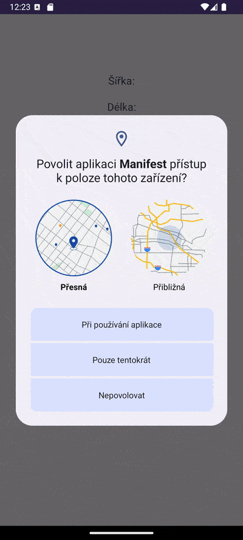

### Zadání úlohy: Lokátor uživatele

Vytvořte aplikaci, která po udělení oprávnění k přístupu k poloze zobrazí poslední známou polohu ve formě souřadnic. Dále uživatelovi umožní otevřít tyto souřadnice pomocí `intentu` např. v Google maps. Použijte `AlertDialog` pro informování uživatele o potřebě oprávnění pro případ, když uživatel oprávnění zamítne.

